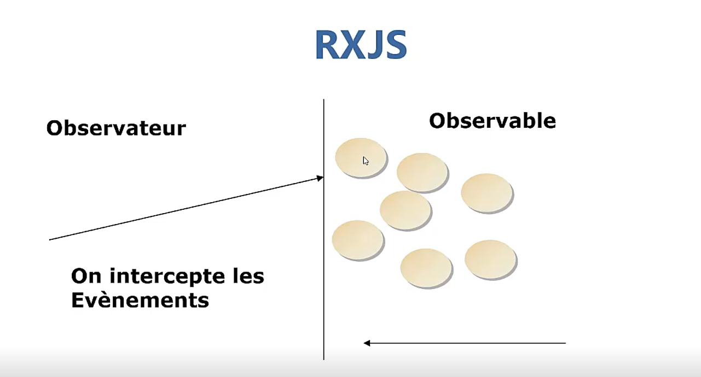

# Routage en Angular
Dans cette section, vous allons les notions de base de routage en angular
## Principe de routage en angular

## La navigation en angular

## Le fichier AppRoutingModule

## L'implémentation du routage
 

## Le système de navigation en ng

## La création des components en ng

## Les paramètres de routage en ng

## Les paramètres de routage 2 en ng

## Comment protéger les routes en ng

## NG CANACTIVE

## Le Protocole HTTP en ng

## Le HTTP et RXJS

## C'est quoi RXJS

## Qu'est ce qu'un observable et un observateur

## Qu'est ce qu'un observable 

## PipeAsync
